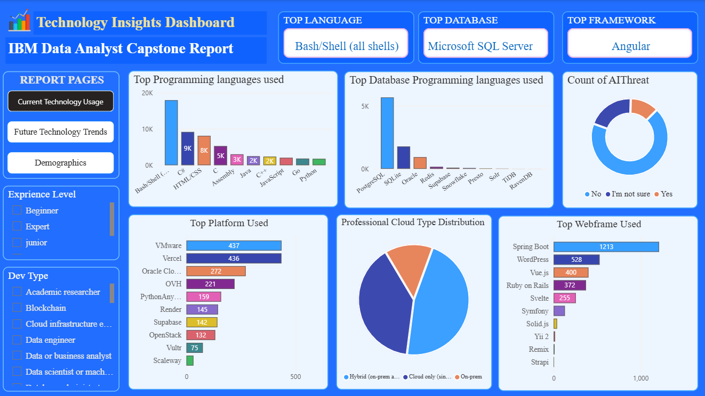
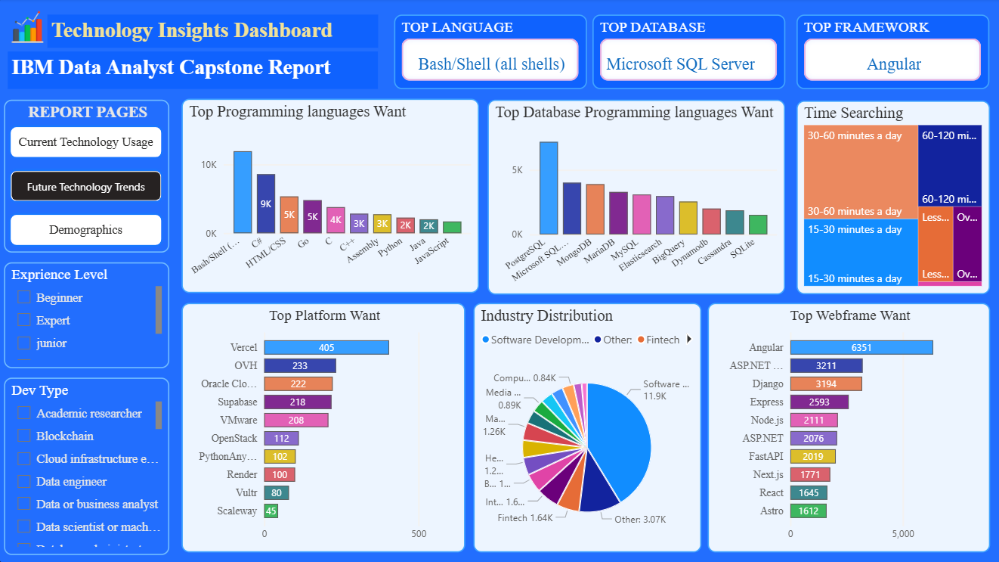
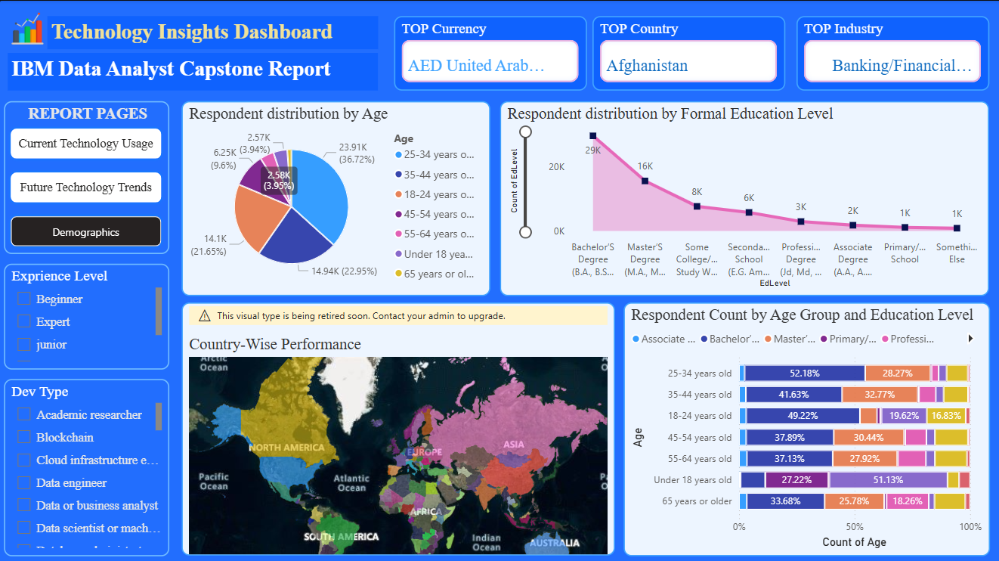

# 📊 IBM Data Analyst Capstone Project

**IBM Data Analyst Capstone Project showcasing end-to-end data analysis including data cleaning, exploratory data analysis (EDA), visualization, and actionable insights using real-world datasets.**

This project is part of the **IBM Data Analyst Professional Certificate** and applies the analytical skills learned throughout the program using tools such as **Python**, **SQL**, and **Power BI**. :contentReference[oaicite:0]{index=0}

---

## 🧠 Project Overview

The goal of this capstone project is to analyze a dataset of global technology professionals to uncover insights about:

- 🔹 **Current technology usage** (programming languages, databases, frameworks)
- 🔹 **Future technology trends** and desired skills
- 🔹 **Respondent demographics** and industry distributions

The analysis includes data cleaning, transformation, visual analysis, and dashboard creation to derive meaningful insights for stakeholders.

---

## 📁 Repository Structure
```

├── 📂 dashboards # Power BI dashboards and visuals
├── 📂 images_videos # Screenshots, charts & story visuals
├── 📂 notebooks # Jupyter notebooks with analysis
│ ├── 01_Current_Technology_Usage.ipynb
│ ├── 02_Future_Technology_Trends.ipynb
│ └── 03_Demographics.ipynb
├── .gitignore
├── IBM_Data_Analyst_Capstone_Report.pdf # Final written project report
└── README.md
```


---

## 🛠 Tools & Technologies

This project utilizes a combination of industry-standard tools for data analysis:

| Technology | Purpose |
|------------|---------|
| **Python** 🐍 | Data cleaning, EDA, visualizations |
| **Jupyter Notebooks** 📓 | Interactive analysis documentation |
| **SQL** 🗃️ | Database querying and manipulation |
| **Power BI** 📊 | Creating dashboards and visual storytelling |
| **Pandas, NumPy, Matplotlib** 📈 | Libraries for data processing and visuals |

---

## 📌 Key Findings

### 🔹 Current Technology Usage

- **Top programming languages:** Bash/Shell, HTML/CSS, C#  
- **Most used database:** PostgreSQL  
- **Most used framework:** Angular  
- **Cloud environments:** Hybrid and cloud-only are popular among respondents

### 🔹 Future Technology Trends 


- Emerging interests in languages like **Go, Python, and C++**  
- Demand for databases like **MongoDB and Microsoft SQL Server**  
- Web frameworks such as **ASP.NET, Django, Express** are gaining interest

### 🔹 Demographic Insights

- Largest respondent age group: **25–34 years**
- Majority hold a **Bachelor’s or Master’s degree**
- Participants represent diverse industries including **Software Development & Finance**

---

## 📄 Final Report

The completed analysis and insights are summarized in the report:

👉 **[IBM Data Analyst Capstone Report (PDF)](IBM_Data_Analyst_Capstone_Report.pdf)**

This document includes:
- Executive summary  
- Interactive visual explanations  
- Interpretation of trends  
- Conclusions and recommendations

---

## 🚀 How to Use This Repository

1. Clone the repository:
   ```bash
   git clone https://github.com/zakiahmed85/IBM-Data-Analyst-Capstone-Python-SQL-PowerBI.git

2. Explore the notebooks to review the code and analysis steps.

3. Open the Power BI dashboards to interact with visual insights.

4. Download the PDF report for a write-up ready for presentation or submission.

## 📜 About the Capstone

This project is the final deliverable for the IBM Data Analyst Professional Certificate — a specialization designed to equip learners with practical analytics skills using real-world data tools and techniques

## 📬 Contact

**Jikiriya**  
Data Analyst  
📧 Email: zakkyzeeshan1931@gmail.com  
🔗 [LinkedIn](https://www.linkedin.com/in/zaki-ahmed85/) 
